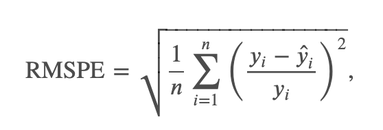

# Rossman Sales Time Series Forecast

Trabajo Practico para la materia de Series Temporales de la Maestría de Data Science de la UBA.

## Descripcion

Rossmann opera más de 3.000 farmacias en 7 países europeos. 

Actualmente, los gerentes de las tiendas Rossmann tienen la tarea de predecir sus ventas diarias con hasta seis semanas de anticipación. 

Las ventas en las tiendas están influenciadas por muchos factores, incluidas las promociones, la competencia, las vacaciones escolares y estatales, la estacionalidad y la localidad. 

Con miles de gerentes individuales que predicen las ventas en función de sus circunstancias únicas, la precisión de los resultados puede variar bastante.

## Evaluacion

Las presentaciones se evalúan según la raíz del error de porcentaje cuadrático medio 𝑅𝑀𝑆𝑃𝐸. 

El RMSPE se calcula como



donde **y_i** denota las ventas de una sola tienda en un solo día y **yhat_i** denota la predicción correspondiente. 

Cualquier día y tienda con 0 ventas se ignora en la puntuación.

## Setup

Ejecutar los siguientes comandos para crear un *virtual environment* e instalarse todas las dependencias necesarias para el proyecto.


Generar un virtual-environment con la version de python en uso.
```
python -m venv .venv
```

Activacion del entorno.
```
source .venv/bin/activate
```

Instalacion de dependencias recursivamente.
```
pip install -r requirements.txt
```
